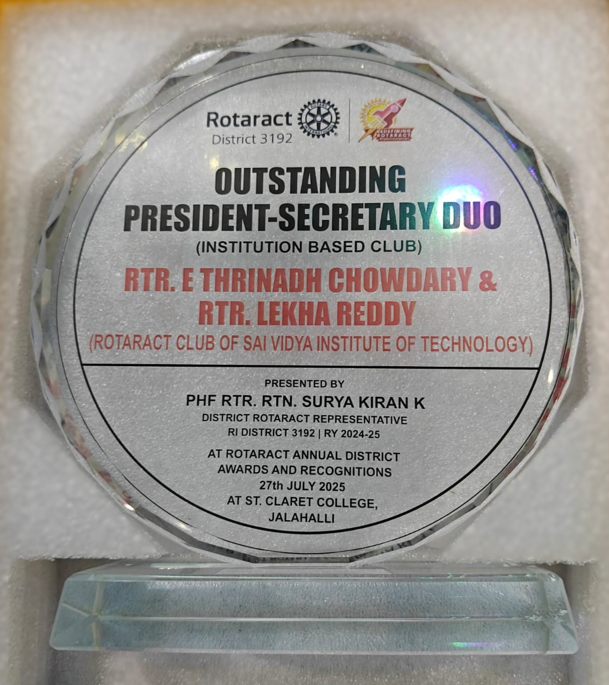
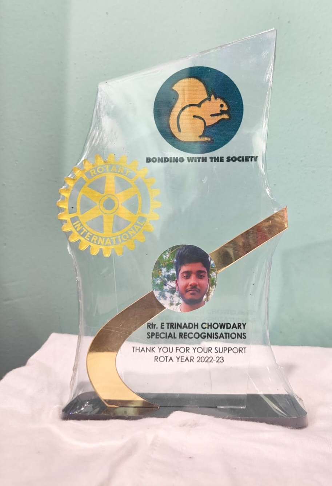
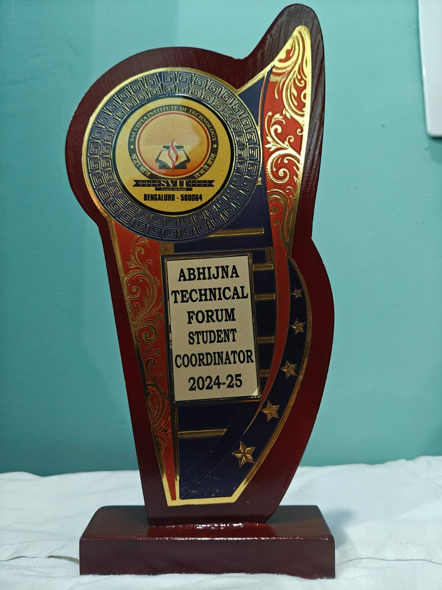

# 🏅 My Awards & Recognitions

### E Thrinadh Chowdary
**BE CSE (AI & ML) Graduate | Full-Stack Developer | AI/ML Enthusiast**

---

*A curated showcase of my awards, recognitions, and honors earned through leadership, academics, creativity, and community service.*

---

## 📑 Table of Contents

- [🎖️ Leadership & Service Awards](#️-leadership--service-awards)
- [🏅 Scholarships & Honors](#-scholarships--honors)
- [🎓 Academic & Technical Awards](#-academic--technical-awards)
- [🎬 Creative & Competition Awards](#-creative--competition-awards)
- [🌍 Community Service Awards](#-community-service-awards)
- [🚧 Coming Soon](#-coming-soon)

---

## 🎖️ Leadership & Service Awards

| # | Award | Organization | Year |
|:-:|---|---|---|
| 1 | **Outstanding President & Secretary Duo (District Level)** | Rotaract District 3192 | 2024–2025 |
| 2 | **Outstanding President & Secretary Duo** | Rotaract Club of SVIT | 2024–2025 |
| 3 | **Emerging Club of the Quarter** (Q1 – Q4) | Rotaract Club of SVIT | 2024–2025 |
| 4 | **Membership Champion** | Rotaract Club of SVIT | 2024–2025 |
| 5 | **Promising Year Theme** | Rotaract Club of SVIT | 2024–2025 |
| 6 | **Transformative Growth of the Year** | Rotaract Club of SVIT | 2024–2025 |
| 7 | **Public Relations Co-Director** | Rotaract Club of SVIT | 2023–2024 |
| 8 | **Diligent Member** | Rotaract Club of SVIT | 2023–2024 |
| 9 | **Special Recognition** | Rotary International | 2022–2023 |

📸 View Award Photos

 

**Outstanding President & Secretary Duo of RcSVIT 2024-25**

| District Level Award (Rotaract District 3192) | Receiving the Award | All Awards | With My Team |
|:---:|:---:|:---:|:---:|
|  |  |  |  |

**Rotaract PR Co-Director & Diligent Member (2023-24)**

| PR Co-Director Appointment | Diligent Member Award |
|:---:|:---:|
|  |  |

**Rotary Special Recognition (2022-23)**

| Rotary Special Recognition |
|:---:|
|  |

**Emerging Club of RcSVIT (Q1 – Q4) 2024-25**

| Q2 Award | Receiving Q2 | Receiving Q3 | Receiving Q4 |
|:---:|:---:|:---:|:---:|
|  |  |  |  |

**Membership Champion of RcSVIT 2024-25**

| Award Certificate | Receiving the Award |
|:---:|:---:|
|  |  |

**Promising Year Theme of RcSVIT 2024-25**

| Receiving the Award | With My Team |
|:---:|:---:|
|  |  |

**Transformative Growth of the Year of RcSVIT 2024-25**

| Receiving the Award | With My Team |
|:---:|:---:|
|  |  |

---

## 🏅 Scholarships & Honors

| # | Scholarship | Awarded By | Year |
|:-:|---|---|---|
| 1 | **Pratt & Whitney Scholarship** — 2nd Year | Pratt & Whitney | 2023–2024 |
| 2 | **Pratt & Whitney Scholarship** — 3rd Year | Pratt & Whitney | 2024–2025 |
| 3 | **Pratt & Whitney Scholarship** — 4th Year | Pratt & Whitney | 2025–2026 |

📸 View Scholarship Certificates

 

| Memento (2022-23) | 2nd Year (2023-24) | 3rd Year (2024-25) | 4th Year (2025-26) |
|:---:|:---:|:---:|:---:|
|  |  |  |  |

---

## 🎓 Academic & Technical Awards

| # | Award | Organization | Year |
|:-:|---|---|---|
| 1 | **2nd Place — Mini Project** | Department of CSE, SVIT | 2024–2025 |
| 2 | **Department Technical Forum — Student Coordinator** | SVIT | 2023–2024 |
| 3 | **Abhijna Technical Forum — Student Coordinator** | SVIT | 2024–2025 |

📸 View Award Photos

 

| 2nd Place — Mini Project (Receiving from HOD) | Dept Tech Forum Coordinator (2023-24) | Abhijna Tech Forum Coordinator (2024-25) |
|:---:|:---:|:---:|
|  |  |  |

| Receiving Dept Tech Forum Award from Principal |
|:---:|
|  |

---

## 🎬 Creative & Competition Awards

| # | Award | Organization | Year |
|:-:|---|---|---|
| 1 | **Short Film Contest — Winner** | Rotaract Club of SVIT | 2024–2025 |

📸 View Award Photos

 

| Receiving from Nagarjun Sir |
|:---:|
|  |

---

## 🌍 Community Service Awards

| # | Award | Organization | Year |
|:-:|---|---|---|
| 1 | **Beach Clean Up Drive — Gratitude Award** | Rotaract Club, Kundapura | 2024–2025 |
| 2 | **Best Campaign & Poster Making — Medal** | Rotaract Club, Kundapura | 2024–2025 |
| 3 | **Beach Clean Up Drive — Completion Certificate** | Rotaract Club, Kundapura | 2024–2025 |

📸 View Award Photos

 

| Gratitude Award | Best Campaign & Poster Making Medal |
|:---:|:---:|
|  |  |

| Completion Certificate | With My Team |
|:---:|:---:|
|  |  |

---

## 🚧 Coming Soon

> **This repository is actively updated!** I'm continuously earning new awards and recognitions. Stay tuned for more additions across:
>
> - 🏆 More Hackathon & Competition Wins
> - 🎖️ Leadership Roles & Recognitions
> - 🎓 Academic Excellence Awards
> - 🌍 Community Impact & Service Awards
> - 💻 Technical & Innovation Awards

---

## 📊 Summary

| Category | Count |
|---|:---:|
| 🎖️ Leadership & Service Awards | 9 |
| 🏅 Scholarships & Honors | 3 |
| 🎓 Academic & Technical Awards | 3 |
| 🎬 Creative & Competition Awards | 1 |
| 🌍 Community Service Awards | 3 |
| **Total** | **19** |

---

### 🔗 Let's Connect!

---

*⭐ If you find this repository useful or inspiring, feel free to star it!*

